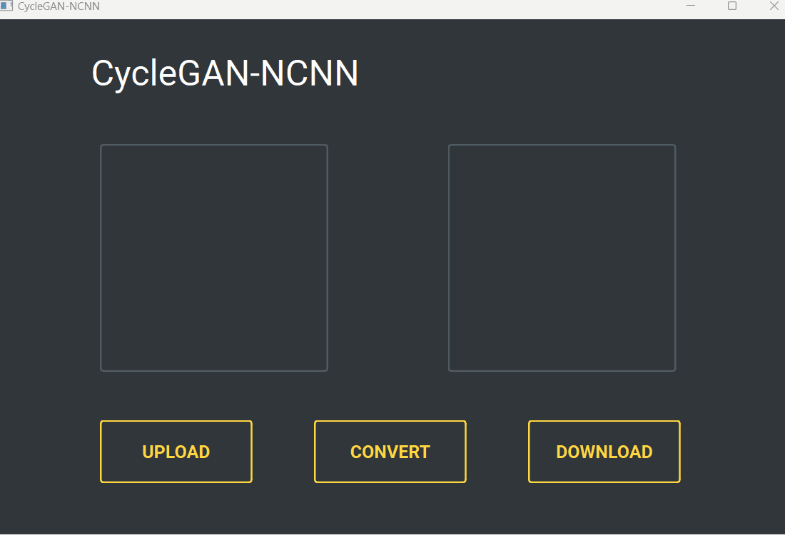

# CycleGAN-NCNN

- [CycleGAN](https://github.com/junyanz/CycleGAN)是在ICCV 2017的文章[Unpaired Image-to-Image Translation using Cycle-Consistent Adversarial Networks](https://arxiv.org/abs/1703.10593)中提出的，可以实现不同风格图像之间的迁移
- 通过在[宫崎骏《起风了》数据集](https://github.com/TachibanaYoshino/AnimeGANv2/releases/download/1.0/Hayao.tar.gz)进行训练，得到图像转动漫风格的PyTorch模型
- 将模型使用[NCNN](https://github.com/Tencent/ncnn)进行推理，提供了C++，Python推理代码的实现
- 基于PyQt6，[Qt-Material](https://github.com/UN-GCPDS/qt-material)创建了一个简单的演示Demo

